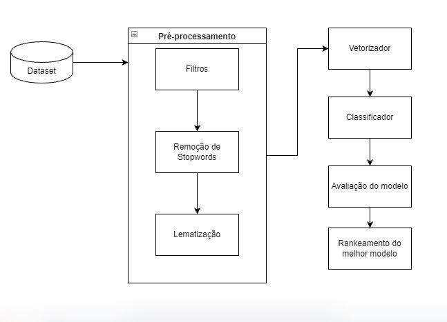

# Treinador de Modelo para Análise de Sentimentos do Twitter com Balancamento de Dados
## Descrição do projeto
Treinador de modelo (com balanceamento de dados) analisador de sentimento do Twitter com processamento de linguagem natural

## Funcionalidades do projeto

- `Funcionalidade 1`: Treina modelos classificadores em três aspectos da base de dados (original, subamostrada e sobreamostrada)
- `Funcionalidade 2`: Baseada na acurácia e na métrica f1, rankeia o melhor modelo

## Aplicação
A metodologia proposta para o desenvolvimento desse projeto pode ser resumida na seguinte figura.

Após o carregamento do dataset original (raw), o conjunto passa por uma etapa de pré-processamento (constituída por filtros, remoção de stopwords e lematização), seguida de vetorização, treinamento/ teste do modelo, avaliação e finalização com rankeamento dos melhores modelos.

- `Filtro`: transforma os caracteres em minusculo e com auxilio da biblioteca de expreções regulares (regex), remove caracteres especiais, números, pontuação, url e emojis.

- `Removedor de stopwords`: remove palavras que não agregam valor ao conjunto.

 

Texto original   | Texto após filtragem
---------------- | --------------------
E o clima esquentou em São Januário depois dessa falta em Nenê! Sobrou até um chinelo no gramado! #FutebolNaESPN https://t.co/KwMai2eSOx | clima esquentou januário dessa falta nenê sobrou chinelo gramado futebolnaespn
@materialgirr @Yuri94031809 O ator falou que ele ia sair depois da 5° temporada, então o Samuel morreu mesmo 😔 | materialgirr yuri ator falou ia sair temporada então samuel morreu

 

- `Lematização`: reduz uma palavra à sua forma base e agrupa diferentes formas da mesma palavra. A lematização com o Spacy é um pouco parecida com a realizada com o Simplema, não são perfeitas, mas ajudam bastante.

 

Texto após filtragem   | Texto lematizado com Spacy
---------------------- | --------------------------
clima esquentou januário dessa falta nenê sobrou chinelo gramado futebolnaespn | clima esquentar januário falta nenê sobrar chinelo gramar futebolnaespn
materialgirr yuri ator falou ia sair temporada então samuel morreu | materialgirr yuri ator falar ir sair temporada então samuel morrer

 

Texto após filtragem   | Texto lematizado com Simplema
---------------------- | -----------------------------
clima esquentou januário dessa falta nenê sobrou chinelo gramado futebolnaespn | clima esquentar januário dessar faltar nenê sobrar chinelo gramar futebolnaespn
materialgirr yuri ator falou ia sair temporada então samuel morreu | materialgirr yuri ator falar ir sair temporada então samuel morrer

 

- `Vetorização`:

- `Algoritimo de classificação`:

- `Avaliação do modelo`:

- `Rankeamento do modelo`:

## Ferramentas utilizadas
- `Jupyter Notebook`
- `Python`
- `Sklearn (machine learning)`
- `Pandas (dataframe)`
- `Matplotlib (gráfico)`
- `Seaborn (gráfico)`
- `re (regex)`
- `Spacy (utilizado como lematizador)`
- `Simplemma (lematizador)`

## Acesso ao projeto

Você pode acessar o [código fonte do projeto](https://github.com/alan-vieira/treinador_analise_sent_model_balance_dados/blob/main/analise_de_sentimentos_twitter.ipynb) ou [baixá-lo](https://github.com/alan-vieira/treinador_analise_sent_model_balance_dados/archive/refs/heads/main.zip).

## Abrir e rodar o projeto
Após baixado, para o funcionamento correto da aplicação as seguintes dependêcias deverão ser instaladas.

- `pandas`
- `nltk`
- `stopwords`
- `pip setuptools wheel`
- `spacy`
- `pt_core_news_sm`
- `simplemma`
- `confplot`
- `openpyxl`

## Autor

| [ Alan Vieira](https://github.com/alan-vieira) |
| :---: |
